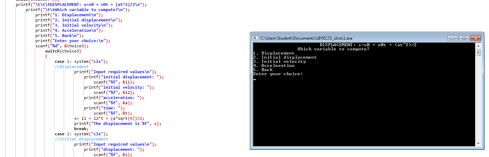

# prelimactivitynumber2-donotincludeanycode-mnsarias
prelimactivitynumber2-donotincludeanycode-mnsarias created by GitHub Classroom
#include <stdio.h>
#include <stdlib.h>
#include <math.h>
/* run this program using the console pauser or add your own getch, system("pause") or input loop */
,,,
int main() 
{
	int choice1, choice2, choice3, loop;
	float p, V, n, r=0.08206, T;
	float s, v, a, t, i1, i2;
	
	while(choice1!=3){
	printf("\t\t\tMAIN MENU: FORMULA SCREEN\n");
	printf("\t\t1. Ideal Gas Law\n");
	printf("\t\t2. Displacement\n");
	printf("\t\t3. Exit\n");
	printf("\t\tEnter your choice: ");
	scanf("%d", &choice1);
	
	switch(choice1)
	{
		case 1: system("cls");
		        while(choice2!=5){
		        printf("\t\t\tIDEAL GAS LAW: PV=nRT\n");
		            printf("\t\tWhich variable to compute?\n");
		                printf("1. Pressure\n");
		                printf("2. Volume\n");
		                printf("3. number of moles\n");
		                printf("4. Temperature\n");
		                printf("5. Back\n");
		                printf("Enter your choice:\n");
		                scanf("%d", &choice2);
		                	switch(choice2)
		                    {
		                    	case 1: system("cls");
		                    	//Pressure
		                    	        printf("Input required values\n");
		                    	            printf("number of moles: ");
		                    	                scanf("%f", &n);
		                    	            printf("Volume (L): ");
		                    	                scanf("%f", &V);
		                    	            printf("Temperature (K): ");
		                    	                scanf("%f", &T);
								        p=(n*r*T)/V;
		                    	        printf("The pressure is %f", p);
		                    	        break;
		                    	case 2: system("cls");
		                    	//Volume
		                    	        printf("Input required values\n");
		                    	            printf("number of moles: ");
		                    	                scanf("%f", &n);
		                    	            printf("Pressure (atm): ");
		                    	                scanf("%f", &p);
		                    	            printf("Temperature (K): ");
		                    	                scanf("%f", &T);
								        V=(n*r*T)/p;
		                    	        printf("The volume is %f", V);
										break;
		                    	case 3: system("cls");
		                    	//number of moles
		                    	        printf("Input required values\n");
		                    	            printf("Pressure (atm): ");
		                    	                scanf("%f", &p);
		                    	            printf("Volume (L): ");
		                    	                scanf("%f", &V);
		                    	            printf("Temperature (K): ");
		                    	                scanf("%f", &T);
								        n=(p*V)/(r*T);
		                    	        printf("The number of moles is %f", n);
										break;
		                    	case 4: system("cls");
		                    	//temperature
		                    	        printf("Input required values\n");
		                    	            printf("number of moles: ");
		                    	                scanf("%f", &n);
		                    	            printf("Volume (L): ");
		                    	                scanf("%f", &V);
		                    	            printf("Pressure (atm): ");
		                    	                scanf("%f", &p);
								        T=(p*V)/(n*r);
		                    	        printf("The temperature is %f", T);
										break;
		                    	case 5:
		                    	         system("cls");
								         break;
							}
							loop++;
						}
		        break;
		case 2: system("cls");
		        while(choice3!=5){
		        printf("\t\t\tDISPLACEMENT: s=s0 + v0t + (at^2)/2\n");
		            printf("\t\tWhich variable to compute?\n");
		                printf("1. Displacement\n");
		                printf("2. Initial displacement\n");
		                printf("3. Initial velocity\n");
		                printf("4. Acceleration\n");
		                printf("5. Back\n");
		                printf("Enter your choice:\n");
		                scanf("%d", &choice3);
		                    switch(choice3)
		                    {
		                    	case 1: system("cls");
		                    	//displacement
		                    	        printf("Input required values\n");
		                    	            printf("initial displacement: ");
		                    	                scanf("%f", &i1);
		                    	            printf("initial velocity: ");
		                    	                scanf("%f", &i2);
		                    	            printf("acceleration: ");
		                    	                scanf("%f", &a);
		                    	            printf("time: ");
		                    	                scanf("%f", &t);
								        s= i1 + i2*t + (a*sqrt(t))/2;
		                    	        printf("The displacement is %f", s);
		                    	        break;
		                    	case 2: system("cls");
		                    	//initial displacement
		                    	        printf("Input required values\n");
		                    	            printf("displacement: ");
		                    	                scanf("%f", &s);
		                    	            printf("initial velocity: ");
		                    	                scanf("%f", &i2);
		                    	            printf("acceleration: ");
		                    	                scanf("%f", &a);
		                    	            printf("time: ");
		                    	                scanf("%f", &t);
								        V=(n*r*T)/p;
		                    	        printf("The volume is %f", V);
										break;
		                    	case 3: system("cls");
		                    	//initial velocity
		                    	        printf("Input required values\n");
		                    	            printf("initial displacement: ");
		                    	                scanf("%f", &i1);
		                    	            printf("displacement: ");
		                    	                scanf("%f", &s);
		                    	            printf("acceleration: ");
		                    	                scanf("%f", &a);
		                    	            printf("time: ");
		                    	                scanf("%f", &t);
								        n=(p*V)/(r*T);
		                    	        printf("The number of moles is %f", n);
										break;
		                    	case 4: system("cls");
		                    	//acceleration
		                    	        printf("Input required values\n");
		                    	            printf("displacement: ");
		                    	                scanf("%f", &s);
		                    	            printf("initial displacement: ");
		                    	                scanf("%f", &i1);
		                    	            printf("initial velocity: ");
		                    	                scanf("%f", &i2);
		                    	            printf("time: ");
		                    	                scanf("%f", &t);
								        T=(p*V)/(n*r);
		                    	        printf("The temperature is %f", T);
										break;
		                    	case 5: system("cls");
								        break;
		                    	default: printf("Not in choices!\n");
		                    	         getch();
		                    	         system("cls");
								         break;
								     }
							}
		        break;
		case 3:
			    system("pause");
			    break;
		default: printf("\t\t\tNot in choices!\n");
		         system("cls");
		         break;
	}
}
	getch();
	return 0;
}
,,,

